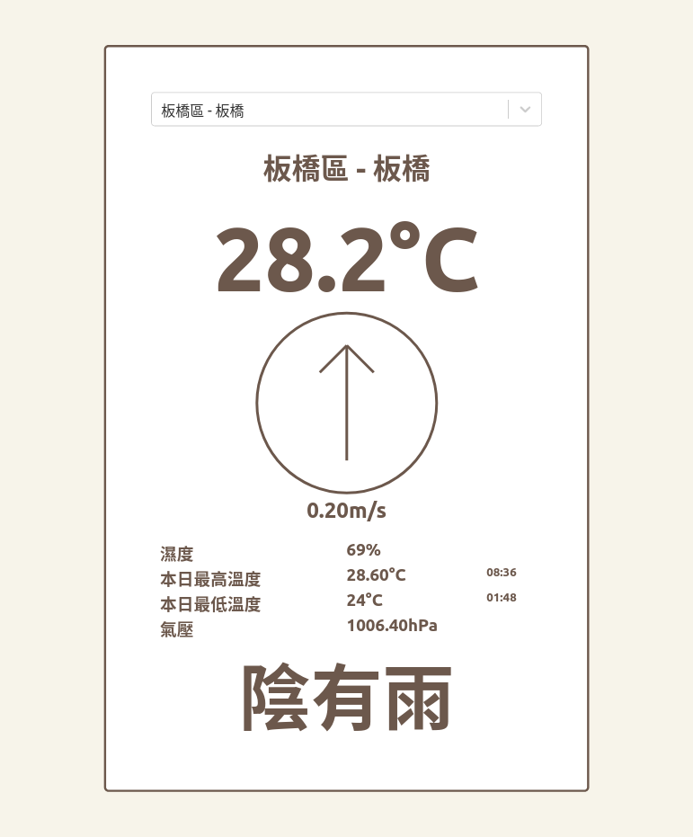

# Weather app



# dev
```
npm run dev
```


# build
```
npm run export
```

# Reference
[https://opendata.cwb.gov.tw/dist/opendata-swagger.html](https://opendata.cwb.gov.tw/dist/opendata-swagger.html)  
[https://e-service.cwb.gov.tw/wdps/obs/state.htm#existing_station](https://e-service.cwb.gov.tw/wdps/obs/state.htm#existing_station)  
[https://opendata.cwb.gov.tw/opendatadoc/MFC/A0012-001.pdf](https://opendata.cwb.gov.tw/opendatadoc/MFC/A0012-001.pdf)  
[https://opendata.cwb.gov.tw/opendatadoc/DIV2/A0001-001.pdf](https://opendata.cwb.gov.tw/opendatadoc/DIV2/A0001-001.pdf)  
[https://opendata.cwb.gov.tw/opendatadoc/CWB_Opendata_API_V1.2.pdf](https://opendata.cwb.gov.tw/opendatadoc/CWB_Opendata_API_V1.2.pdf)  

